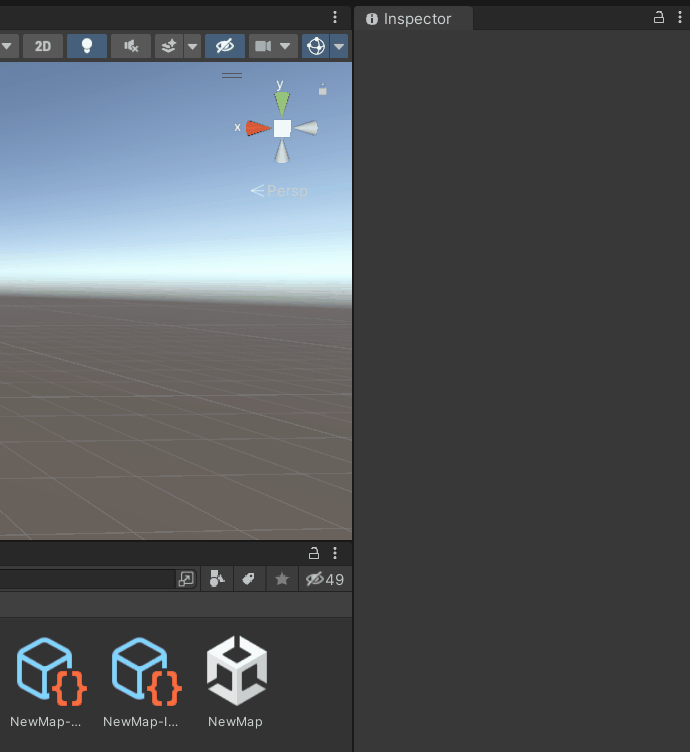
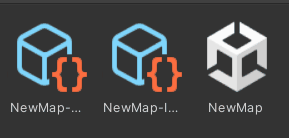
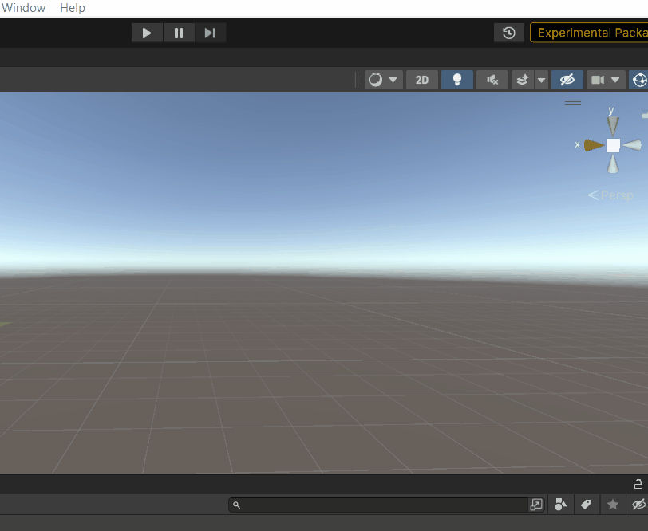

# Map Setup

The easiest way to set up your scene is by right clicking, and going to `GMBDK > Starters > Map Starter`.
This will set up all the basic things you need to get started with making maps.

## Renaming the Map Starter assets

> [!WARNING]
> You should save often already, but in case you don't particularly pay attention to how often you save, make sure to save your project (`Ctrl + s`) before you make any of the following modifications.

To rename your map, simply rename the assets and Addressable keys belonging to it. Start with the Addressable key, found next to the Addressable checkbox in the assets' Inspector windows. Make sure to keep the hyphens (`-`) and whatever comes after them, and to use `PascalCase` for the names of maps, as shown below:

Ensure your asset names are the same as the ones you put next to the Addressable label, as shown below:

It may prompt you to reload the scene. Please do so.

Now, one more step. Set the `Active Mod Name` variable in `GBMDK > Open Config` to the name of the mod the map you are making is a part of. This name can be the same as the map's name. It is only used to name the folder the addressables are contained within.

You can also more directly set the `ModName` variable in the Addressable profile, as shown below:

> [!NOTE] 
> This will sometimes revert back to `NewMod` or `ModName` if the project is closed then reopened. Simply do this again when you reopen it and you will be good.

You have now successfully renamed your map.

## Where to next?

- To learn how to set up basic objects for interaction, such as grabbing, damaging, and physics audio, go to [GameObject Setup](./gameobject-setup.md).
- To learn how to set your map up for AI, go to [NavMesh Baking](./navmesh-baking.md).
- To learn how to set your map up for specific gamemodes, go to [Gamemode Setup](./gamemode-setup.md).
- To learn how to add music to your map, go to [Adding Music](./adding-music.md).
